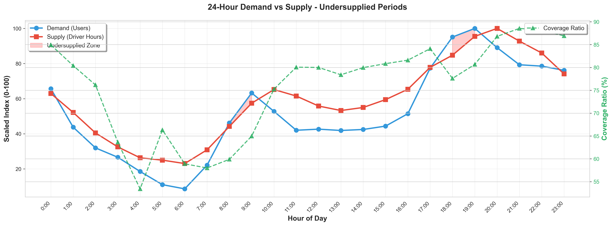
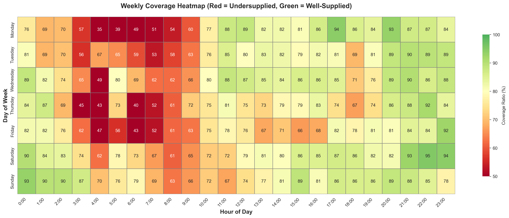
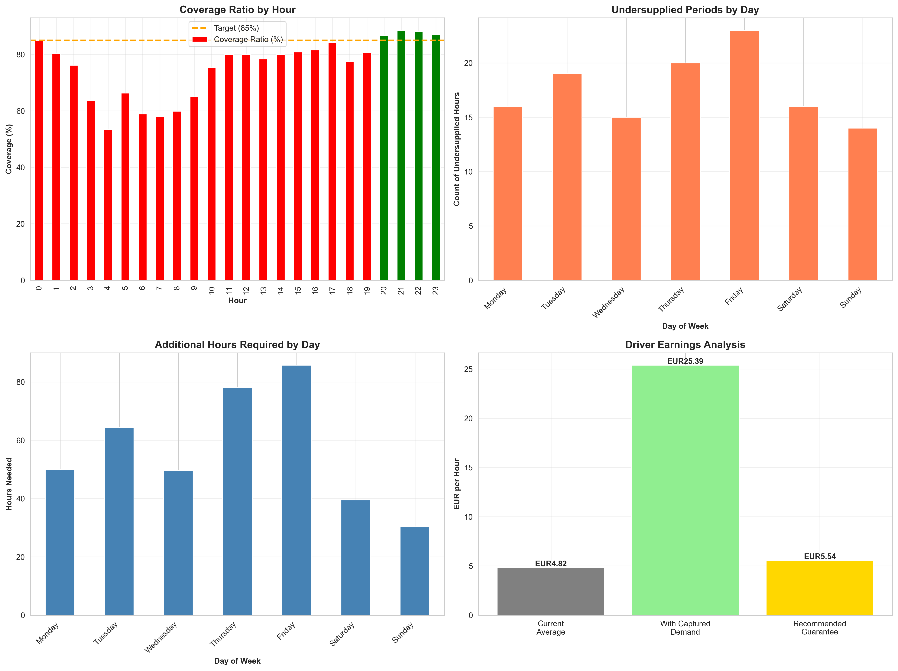

# Bolt Data Analytics
## Ride-Hailing Demand-Supply Optimization


## 📊 Project Overview

Analysis of ride-hailing platform demand-supply dynamics to identify undersupplied periods and optimize driver allocation. This project examines 839 hours of operational data across 5 weeks to develop data-driven recommendations for improving service coverage.

## 🎯 Key Findings

- **123 undersupplied periods** identified below 85% coverage threshold
- **~397 additional driver hours** required to achieve target coverage (+15.9% increase)
- **Targeted earnings guarantee strategy** recommended during critical undersupply windows
- Early morning weekdays (4-7 AM) show critical undersupply (35-53% coverage)
- Evening peaks (6-9 PM) demonstrate moderate undersupply (60-75% coverage)

## 📁 Project Structure

```
Bolt-Data-Analytics/
│
├── Bolt_Analysis.ipynb              # Main analysis notebook
├── Data/                             # Dataset folder
│   ├── Demand Data - Hourly_OverviewSearch_1.csv
│   └── Supply Data - Hourly_DriverActivity_1.csv
│
├── Demand_Supply_24h.png             # 24-hour demand-supply visualization
├── Coverage_Heatmap.png              # Weekly coverage heatmap
├── Summary_Dashboard.png             # 4-panel summary dashboard
├── requirements.txt                 # Python dependencies
└── README.md
```

## 🔍 Analysis Approach

### Undersupplied Time Periods
- **Methodology**: Analyzed hourly demand-supply data, defined undersupply as coverage <85%
- **Visualizations**: 
  - 24-hour demand-supply curve showing peak mismatches
  - Weekly heatmap revealing critical undersupply patterns
- **Key Insight**: Supply lags demand by 1 hour during evening peak

### Required Capacity
- **Calculation**: Gap-based formula with 1.5x buffer for utilization rates
- **Priority Allocation**:
  - Severe (<60% coverage): 95 hours
  - Moderate (60-75%): 205 hours
  - Mild (75-85%): 97 hours

### Earnings Guarantee Strategy
- **Approach**: Targeted hourly guarantee aligned with peak undersupply windows
- **Mechanism**: Incremental earnings incentive to align driver supply with demand
- **Economics**: Minimal program cost vs. substantial captured demand revenue
- **Assumptions**: Conservative demand capture and conversion estimates

## 📈 Analysis Output

Visualizations are generated dynamically during notebook execution:

### 24-Hour Demand vs Supply Curve
Shows peak demand at 19:00 (evening) with supply peaking one hour later at 20:00. Red-shaded zones highlight undersupplied periods, with critical shortfalls during early morning hours (4-7 AM).



### Weekly Coverage Heatmap
Reveals systematic undersupply (red zones) concentrated in weekday early mornings and moderate shortfalls during evening peaks. Weekends show better coverage but still below 85% target in many periods.



### Summary Dashboard
Four-panel analysis showing:
- **Top-left**: Coverage ratio by hour with 85% target line
- **Top-right**: Count of undersupplied periods by day of week
- **Bottom-left**: Additional driver hours required by day
- **Bottom-right**: Driver earnings analysis comparing current baseline vs. captured demand vs. recommended guarantee



## 🛠️ Technologies Used

- **Python 3.13+**: Core programming language
- **Pandas**: Data manipulation and aggregation
- **NumPy**: Numerical computations
- **Matplotlib**: Data visualization
- **Seaborn**: Statistical visualizations

## 📊 Dataset Details

**Data Period**: November 14 - December 18, 2016 (5 weeks)

**Demand Data** (839 hourly records):
- People saw 0 cars (unique)
- People saw +1 cars (unique)
- Coverage Ratio (%)
- Timestamp

**Supply Data** (840 hourly records):
- Active drivers
- Online hours
- Finished rides
- Rides per online hour (RPH)
- Timestamp

## 🚀 Getting Started

### Prerequisites
```bash
pip install pandas numpy matplotlib seaborn jupyter
```

### Running the Analysis
```bash
jupyter notebook Bolt_Analysis.ipynb
```

## 💡 Key Insights

1. **Demand Elasticity**: Coverage ratio correlates with completed rides. Below 70% coverage, user demand destruction accelerates significantly.

2. **Supply-Demand Mismatch**: Drivers avoid early morning periods despite user demand due to earnings incentive structure. Targeted guarantee addresses this operational gap.

3. **Economic Opportunity**: Substantial missed demand exists during undersupply periods, creating strong business case for supply optimization.

4. **Strategic Mechanism**: Guarantee acts as temporary supply catalyst. As drivers experience consistent demand during previously low periods, market equilibrium can self-sustain.

## 📌 Business Recommendations

### Immediate Actions
1. Launch EUR 5.54/hour guarantee for 4-7 AM weekdays
2. Implement real-time dashboard tracking coverage and costs
3. Create driver communication campaign via app notifications

### Success Metrics
- Coverage >85% in 90% of guaranteed hours within 6 weeks
- Subsidy payout <50% of gross revenue captured
- Driver participation rate >40% during guaranteed hours
- User complaints about "no cars" down by 60%

## 🔗 Related Projects

- [Uber Data Analytics](https://github.com/z12ob/Uber-Data-Analytics) - Similar demand-supply analysis for Uber dataset

## 📄 License

This project is open source and available for educational purposes.

## 👤 Author

**Guram Melikidze**
- GitHub: [@z12ob](https://github.com/z12ob)

---

*Analysis demonstrates data-driven approach to ride-hailing operations optimization, combining statistical analysis with business strategy.*
